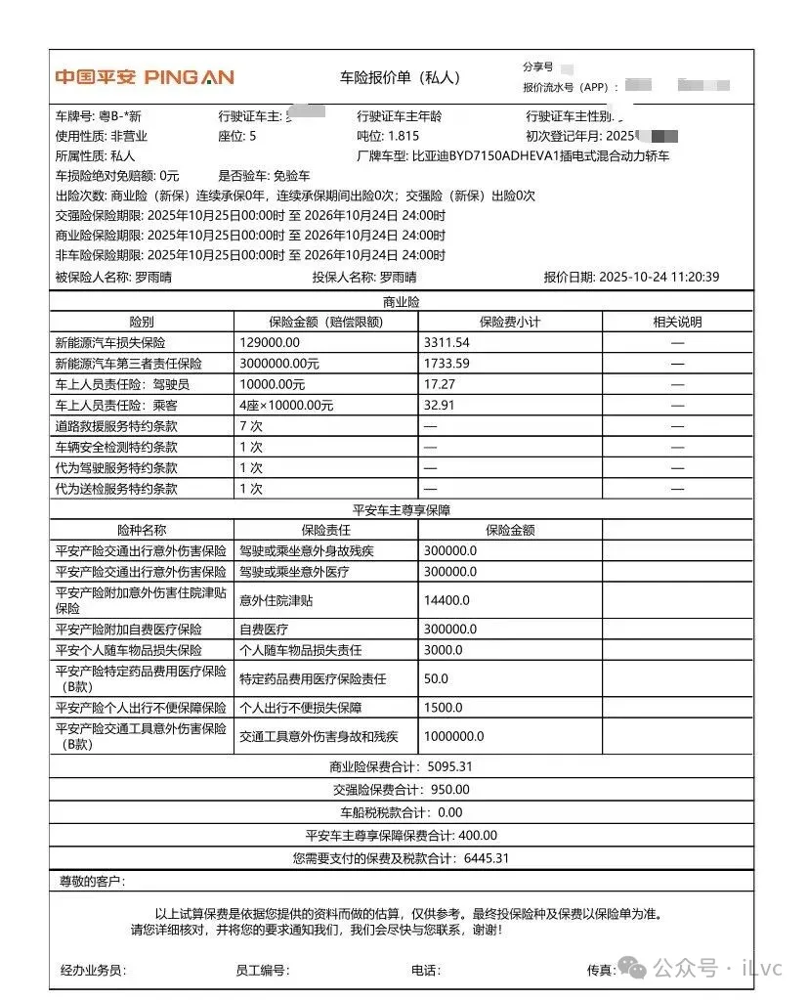

##### 买保险：别“全险”也别“裸险”

新车保险一般建议在4S店买（方便上牌），但别听销售说“必须买全险”。新手买这几个险种就够了：

- **交强险**：强制买的，不买不能上牌，主要保第三方的人身伤亡和财产损失。
- **车损险**：保自己的车，比如碰撞、火灾、自然灾害造成的损失，新手一定要买。
- **第三者责任险**：保第三方的损失，建议买200万保额（现在路上豪车多，保额买高一点放心）。
- **不计免赔险**：附加险，买了之后保险公司会全额赔付（不然可能只赔80%）。

我当时买的保险是6400多块，和车友群里的价格差不多，算是合理。买之前可以在群里问问其他车主的保险价格，心里有个数，避免被坑。