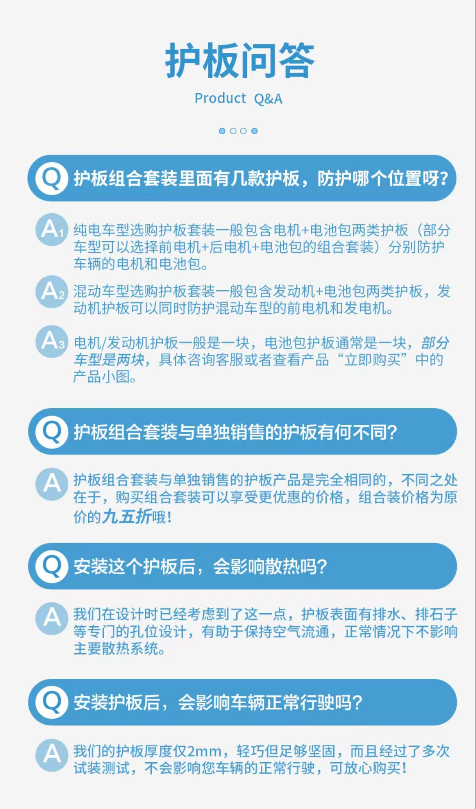

# 装护板：给底盘“穿件铠甲”

提车后建议尽快装“电池电机护板”，尤其是经常走烂路或郊区的车主。护板能防止石头、坑洼刮到底盘，保护电池和电机（这两个是新能源车最值钱的部件）。

我当时谈价时就要求4S店赠送电池电机护板，提车当天就让他们现场安装。安装时要盯着点，别让师傅偷工减料——我当时就发现师傅没装垫片，还说“螺帽够紧，不用装”，我坚持要求他必须全部装上去，师傅才照做。

---

## 护板是什么？

- 纯电车型选购护板套装一般包含电机+电池包两类护板(部分车型可以选择前电机+后电机+电池包的组合套装)分别防护车辆的电机和电池包。
- 混动车型选购护板套装一般包含发动机+电池包两类护板，发动机护板可以同时防护混动车型的前电机和发电机。
- 电机/发动机护板一般是一块，电池包护板通常是一块，部分车型是两块。

以下来自BYD app商场对护板问答

