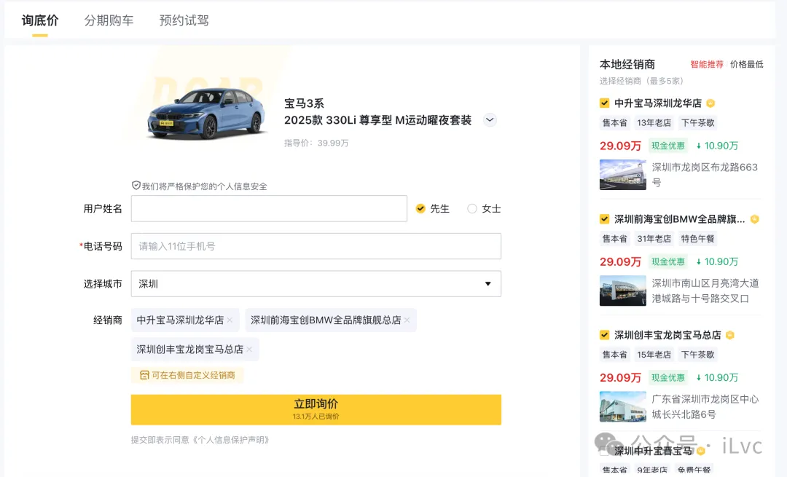
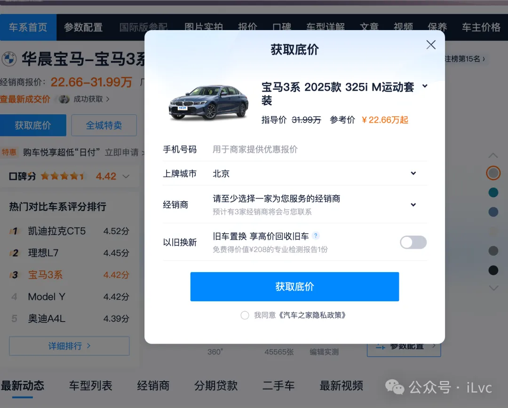

# 看车试驾：纸上谈兵不如亲身体验

信息收集得差不多，就别再对着手机看参数了——车是要开的，一定要去线下看实车、试驾，这一步能帮你排除很多“图片党”车型（比如网上看着很大，实际空间很小）。

## 1、去哪看车？

新手常犯的误区是“不知道去哪看车”，其实主要就两个渠道：

- **4S店**：品牌官方授权的门店，车源正规，能看到实车、试驾，后续的订车、上牌、售后都能一站式解决。缺点是可能比较偏，比如我看比亚迪豹旅时，家附近的商超店没有现车，得跑到福永的4S店。
- **商超店**：开在商场里的汽车展厅，优点是位置方便，逛街时就能顺便看车；缺点是一般只有展车，不能试驾，而且车型不全。我之前在广州商场里看过小米SU7，只能隔着围栏看，连车门都打不开。

懂车帝、汽车之家等应用都提供“询低价”、“约试驾”功能，可以填报下信息，坐等4S 店工作人员电话来问。

懂车帝 询低价页面

汽车之家 获取低价页面

建议联系时要确认“有没有目标车型的现车”“能不能试驾”，避免白跑一趟。我当时就吃过亏，第一次去粤星4S店，销售说有“现车”，到了才知道是展车，不能试驾，白折腾了半天。

## 2、看车看什么？别只看“颜值”

很多新手看车只关注外观和内饰好不好看，其实有几个关键细节更重要，尤其是对家庭用户来说：

- **空间**：打开车门坐进去，感受前排腿部空间（调整到自己舒服的驾驶姿势，膝盖别顶到中控台），后排坐三个人会不会挤，后备箱能不能放下婴儿车、行李箱这些常用物品。我当时特意把豹旅的后排座椅放倒，爬上去躺了躺——虽然一米七的身高坐不直，但放东西的空间足够，这就符合我的需求。
- **配置实用性**：别被“花里胡哨”的功能忽悠。比如我关注的“智驾”，要亲自试试自适应巡航（跑高速不用一直踩油门）、车道保持（不会跑偏）、自动泊车（新手停车的救星）这些功能好不好用；中控屏幕别只看尺寸，要看操作顺不顺畅，有没有卡顿。
- **细节做工**：摸摸车门的缝隙是不是均匀，内饰塑料件有没有刺鼻的味道，座椅的材质舒不舒服。我当时看车时，旁边有位大哥发现车头雷达的车漆刮花了，这种小瑕疵虽然不影响使用，但可以作为谈价的筹码。

## 3、试驾重点：感受“开起来的感觉

试驾是买车最关键的一步，新手别紧张，也别被试驾员带着跑，重点感受这几点：

- **动力和操控**：起步会不会“肉”（踩油门没反应），加速顺不顺畅，刹车灵不灵。我试驾豹旅时，特意让试驾员开了快速路，体验了辅助驾驶——双手轻轻搭在方向盘上，车能自己保持车道、跟车，那种“科技感”让我很安心，这也是我选它的原因之一。
- **舒适性**：过减速带时，底盘会不会太颠；隔音效果好不好（跑快了风噪、胎噪大不大）；座椅支撑性怎么样，长时间开车会不会累。
- **功能适配性**：如果有孩子，看看儿童安全座椅的接口好不好装；手机充电口够不够用，有没有无线充电；空调制冷、制热快不快。这些细节直接影响后续的用车体验。

注意：试驾需要带和驾驶证（电子驾驶证就可以了），如果自己不敢开，可以让试驾员开，你坐在副驾感受。我当时因为很久没开车，就没敢试驾，全程让试驾员开，重点体验了智驾功能和舒适性。